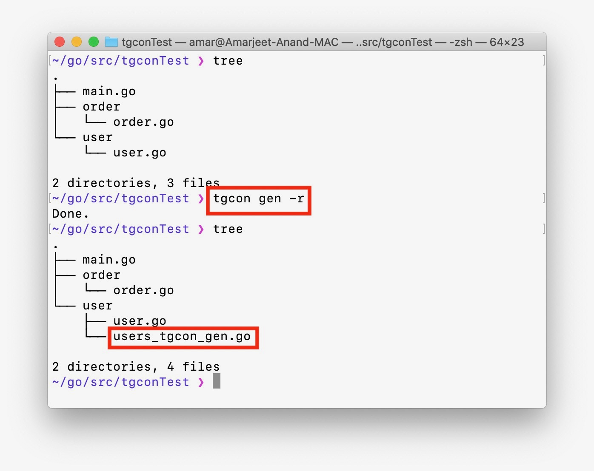

# tgcon - tag as const
Generates struct field tag values as string constant.

[](https://travis-ci.org/github/amarjeetanandsingh/tgcon)
[](https://goreportcard.com/report/github.com/amarjeetanandsingh/tgcon)

# Installation
```shell script
go get -u github.com/amarjeetanandsingh/tgcon
```


# Why we need this tool?
### Problem
We can't use string `var / const` in tags. Below is an illegal syntax -
```golang
type user struct {name string `json:"` + FIELD_NAME + `"`}
```
[Keeping tags simple](https://github.com/golang/go/issues/4740#issuecomment-66074233) is good, but this becomes quite a problem when we have to access the tag value.
This leads to a situation where we need to type a string literal(`tag values`) whenever we need to use them. 


### Solution
_**We can't use string const as tag value, but we can generate tag values as string const.**_


`tgcon` helps generate string constant for struct field tag values, and we can use the constant everywhere in the code. 
- This prevents any bug caused by typo, that escapes the build time check.
- In case somebody changes the tag values, you just have to regenerate constants using `tgcon`. We can use `go-generate` to automate the const generation.
- In case somebody renames a struct field, it will fail the build unless its fixed at every place(_because new struct field will generate new const_)

# Usage
`tgcon` have 2 sub-commands - 1) `gen` 2) `clean`

## 1) tgcon gen
```
tgcon gen [flags]
```

- It generates struct field tag values as string constant for all the eligible struct(_use magic comment to filter_) fields into a single file. 
- One constant file is generated per directory with file name as `<package_name>_tgcon_gen.go`.
- By default, it parses only those structs which contains a **magic comment**, `tgcon`, in a comment associated to them.
- Use `--all` flag to generate field tag constant for all structs irrespective of the magic comment


### Options

```
  -a, --all                          Process all structs irrespective of magic comment
  -f, --defaultTagValFormat string   Format to generate tag value constant for fields with no tags. Default format is  Currently supports [camelcase, lispcase, pascalcase, snakecase]
  -d, --dir string                   Generate constants for the given dir (default ".")
  -h, --help                         help for gen
  -s, --onlyTagged                   Do not create constants for unTagged fields. -s means skip
  -r, --recursive                    Recursively create constants for all subdirectories too
  -t, --tags strings                 Create constants only for given comma separated list of tags. Empty means process all available tags
```


#### Generated Content

**users_tgcon_gen.go**

```go
// Code generated by tgcon; DO NOT EDIT.
package users

const (

	// ---------------------  File: user.go  ---------------------
	// Struct: User
	UserAgeJson  = "age"
	UserNameJson = "name"
)
```
## 2) tgcon clean
```
tgcon clean [flags]
```

- It reverses the action of `tgcon gen` command.
- It deletes all files with `_tgcon_gen.go` as suffix in their name in the given directory.
- Use `-r` to clean all subdirectories too.


### Options
```
  -d, --dir string   Delete generated const file from given directory (default ".")
  -h, --help         help for clean
  -r, --recursive    Recursively delete generated const files for all subdirectories too
  -v, --verbose      Prints the generated files getting deleted.
```

[comment]: <> (# Your feedback matters, Create a google forms)


## Donate
[Sponsor Open Source development activities and free contents for the community.](https://amarjeet.in)
